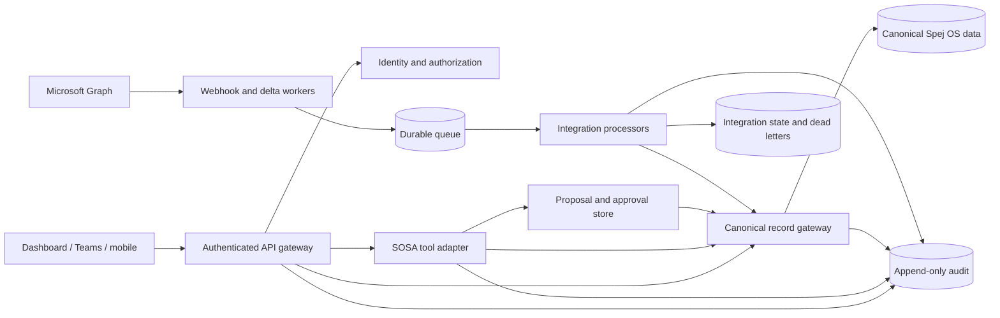

# Production architecture

**Status:** implementation handoff. This document describes the target company architecture; it does not claim that Microsoft 365, the existing SOSA, company identity, or canonical Spej OS services are connected in this repository.

## Current preview and production target

| Area | Current local preview | Required production target |
| --- | --- | --- |
| Runtime | Next.js bound to loopback | Private, authenticated application behind the company gateway |
| Users | One trusted local user; no login | Spej identity with tenant, user, role, and permission claims |
| Home / Today | Demo profile and local records | Identity-backed projection of the signed-in employee's authorized work |
| Records | Local SQLite and whole-workspace saves | Canonical, record-level Spej OS services with transactions and versions |
| SOSA | Standalone pilot adapter and reviewed proposal logic | Existing SOSA calling governed tools with the user's verified identity |
| Microsoft 365 | Not connected | Separate, least-privilege Graph connector and Teams channel adapter |
| Background work | In-process local scheduler | Durable queue workers with retries, dead-letter handling, and monitoring |
| Secrets | Local settings/environment | Managed secret store; encrypted at rest and never returned to the browser |
| Audit | Local application history | Append-only company audit events for reads, proposals, approvals, commits, and connector actions |

Do not publish the current loopback service by only changing its bind address. Production requires all controls in the right-hand column.

## Reference handoff modules now included

The repository now includes tested, provider-neutral reference boundaries. They are **not wired to application routes or live company services**:

- [`lib/server/auth/principal.ts`](../lib/server/auth/principal.ts) and [`lib/server/auth/task-visibility.ts`](../lib/server/auth/task-visibility.ts): normalized principal plus explicit owner/workspace/company task-policy references;
- [`lib/server/canonical-record-gateway.ts`](../lib/server/canonical-record-gateway.ts): in-memory reference for scoped reads, immutable proposals, approval binding, optimistic versions, atomic commits, idempotency, and audit evidence;
- [`lib/integrations/contracts.ts`](../lib/integrations/contracts.ts): minimized connector event envelope and strict validation;
- [`lib/server/integration-event-store.ts`](../lib/server/integration-event-store.ts): in-memory reference for authenticated enqueue, claims, retries, dead letters, deduplication, and safe cursor advancement;
- [`lib/integrations/microsoft/`](../lib/integrations/microsoft): pure Microsoft read-event mappers and outbound action validators; no Graph client or executor;
- [`lib/integrations/sosa/contracts.ts`](../lib/integrations/sosa/contracts.ts): deterministic tool permission and human-confirmation policy;
- [`.env.production.example`](../.env.production.example): fail-closed configuration names; its values are placeholders.

Spej IT must replace the in-memory references with durable adapters and connect authenticated routes. The current dashboard still uses its existing local persistence and agent flow.

## Target component model

The dashboard, Teams, mobile clients, and SOSA are interfaces over the same canonical records. They must not maintain separate CRM or project copies.

## Request identity

Every production request carries a server-verified principal containing:

- `tenantId`, stable `subject`, display-safe actor label, authentication method, and session/request identifiers;
- granted roles and explicit permissions;
- any record, team, or business-unit scope enforced by Spej OS.

The gateway rejects missing, expired, locally fabricated, or cross-tenant principals. A name, email address, Teams message body, model output, or browser-supplied role is not authorization.

Service-to-service calls use workload identity with a narrower capability set than interactive users. An initiating user remains attached to the request when a worker or SOSA acts on the user's behalf.

## Identity-backed Home and Today

The local preview may offer a demo or **view-as** profile so the team can evaluate role-specific layouts. Production must ignore any client-selected identity and derive the viewer from the server-verified Entra/Spej principal. A user may choose layout preferences such as saved filters, sections, and density, but those preferences never grant permissions or expand record visibility.

Home is the employee's clean operating view; Today is its deterministic work projection. It queries canonical tasks plus authorized next actions and deadlines attached to accounts, opportunities, projects, content, and other records, then applies documented filters and ordering. It must not create a second task database or rely on an LLM to decide what exists, what is assigned, or what is due. The same canonical record and task IDs must resolve from the dashboard, Teams, Outlook, SharePoint/OneDrive references, and SOSA.

Authorize before personalizing. Every task carries a stable owner profile, workspace, business category, and visibility of Owner only, Workspace members, or Company-wide. Missing legacy visibility fails closed to Owner only; subtasks inherit the parent workspace and visibility. Category and job title never grant access. Leadership and access administration do not automatically disclose private task content. See [Access control and task visibility](ACCESS_CONTROL_AND_TASK_VISIBILITY.md).

## Canonical record gateway

The production adapter exposes permission-aware, record-level operations:

1. `search` returns only fields and records visible to the principal; filtering occurs before counts, pagination, ranking, or Today projections.
2. `read` returns a canonical ID and current version.
3. `prepare` validates a bounded change set without saving it.
4. `commit` rechecks identity, permissions, expected versions, approval, and idempotency before one atomic transaction.
5. `audit` records the result without secrets or unnecessary content.

Every mutation includes a unique request ID and expected record version. The adapter validates the entire change set before writing anything. A conflict returns a structured result; it does not silently overwrite newer data. Field-level patches preserve fields owned by other Spej OS modules.

Files, meeting transcripts, messages, and other artifacts attach to canonical account, opportunity, project, and task IDs through reference records. Microsoft 365 remains the source of truth for Microsoft-hosted content; Spej OS stores the authorized locator, version, relationship, and approved derived metadata rather than an uncontrolled duplicate.

## Provider-neutral integration intake

All external connectors map provider data into one bounded event envelope before business logic runs. The envelope includes provider, tenant, external object ID, external version, event kind, source and receive timestamps, an idempotency key, a safe source reference, and minimized payload metadata. It excludes access tokens, client secrets, cookies, full document bodies, and other credentials.

Processing order:

1. Authenticate the provider and validate the tenant/resource.
2. Normalize and schema-validate the envelope.
3. Persist it durably and acknowledge the provider promptly.
4. Deduplicate by provider, tenant, object ID, and external version.
5. Process under an authorized service principal.
6. Commit canonical changes atomically or produce a review proposal.
7. Advance the resource cursor only after successful processing.
8. Retry transient failures with bounded backoff; move exhausted events to a dead-letter queue.

Microsoft-specific mapping is defined in [Microsoft integration contract](MICROSOFT_INTEGRATION_CONTRACT.md).

Before bidirectional task synchronization is enabled, Spej IT must designate the canonical task system and document field ownership, identity mapping, conflict policy, and deletion behavior. Until that decision is approved and tested, external task ingestion must remain read-only or proposal-only.

## SOSA action path

SOSA receives permission-filtered context and tool schemas, not unrestricted database or whole-workspace access. Mutating requests follow:

`read -> propose -> deterministic validation -> human approval when required -> commit -> audit -> refresh`

The approved proposal is immutable and bound to the principal, tenant, exact operations, record versions, and expiration time. The model cannot approve its own proposal. See [SOSA tool contract](SOSA_TOOL_CONTRACT.md).

## Deployment units

- **Web application:** stateless UI and authenticated API entry points.
- **Canonical adapter:** connects GTM/CRM/project concepts to existing Spej OS services.
- **SOSA adapter:** registers governed read and action tools with the existing agent.
- **Integration receiver:** validates webhook notifications and enqueues work.
- **Workers:** perform Graph delta reads, transcript processing, reconciliation, and retries.
- **Stores:** canonical records, proposal state, integration state/cursors, audit, and telemetry.

Do not depend on local files, SQLite, or an in-process scheduler for multi-instance production operation. If the web tier is serverless, queues and scheduled workers must run in durable infrastructure outside request lifetimes.

## Non-functional requirements

- Encryption in transit and at rest; secrets in an approved manager.
- Tenant isolation and least privilege at every service boundary.
- Structured logs with correlation IDs and redaction.
- Metrics for queue age, failure rate, cursor lag, authorization denials, conflicts, approval latency, and connector health.
- Tested backup/restore for canonical and integration state.
- Defined retention for message excerpts, transcripts, proposals, audit records, and dead letters.
- Feature flags and per-tenant connector kill switches.

Release gates and operating steps are in [Deployment runbook](DEPLOYMENT_RUNBOOK.md); staged cutover is in [Migration and rollback](MIGRATION_AND_ROLLBACK.md).
